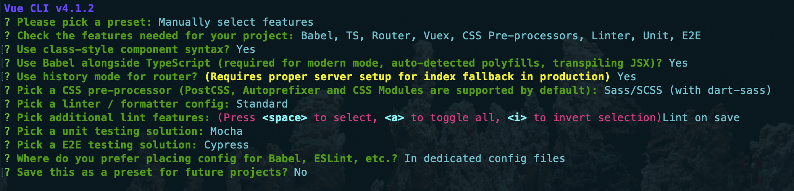

# vue-weus 更新日志

## v0.2.0 加入 Vuetify (2020-1-19)

* [Vuetify 官网](https://vuetifyjs.com/zh-Hans/)
* 加入 vuetify@2.2.4
* 加入 scss 变量，在 src 下创建文件 scss/variables.scss 
* 单元测试有问题，待处理
* 启动服务耗时太长，待优化
* 打包的时候，css 没有按需打包，待优化
* vuetify 例子，待补充

## v0.1.0 开启 vue-weus 之旅 (2020-1-18)

* 利用 @vue/cli 4.1.2 搭建基于 vue vue-router vuex 项目框架，命令为 ```vue create vue-weus```
* 使用 TypeScript Sass vue-class-component Mocha Cypress 等
* 使用 ```npm outdated``` 更新 npm 依赖后，由于没有安装部分 peerDependencies 和 devDependencies，需要手动安装一下依赖
  ```bash
  npm install --save-dev @typescript-eslint/eslint-plugin @typescript-eslint/parser
  npm install --save-dev eslint-plugin-import eslint-plugin-node eslint-plugin-promise eslint-plugin-standard eslint-plugin-vue
  ```

创建 app

创建 app 配置项

